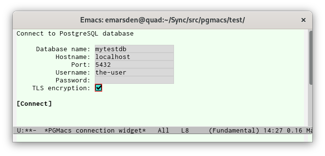

# Quickstart

You will need the [pg-el library](https://github.com/emarsden/pg-el/) installed, available in
the [MELPA](https://melpa.org/) package archive:

    M-x package-install RET pg

PGMacs is not currently distributed in MELPA. In the meantime, do the following in a terminal:

    git clone https://github.com/emarsden/pgmacs.git

Load the library from Emacs with 

    M-x load-file RET /path/to/pgmacs/pgmacs.el

## Connecting to a PostgreSQL database

With the pgmacs.el library loaded, say 

    M-x pgmacs
    
This will open a widget-based buffer to collect connection information (database name, hostname,
port, etc.). 

It will then open the PGMacs main buffer, which will show you a list of the tables available in the
database.

You can also open pgmacs with a connection object from the pg.el library (function `pgmacs-open`),
or with a PostgreSQL connection string such as `user=myself port=5432 dbname=mydb` (function
`pgmacs-open/string`) or with a PostgreSQL connection URI such as
`postgresql://%2Fvar%2Flib%2Fpostgresql/dbname` (function `pgmacs-open/uri`). 

## Browsing a table

From the buffer that displays a list of the tables in the database you are connected to, type RET on
the name of a table to enter a table buffer. This presents some metainformation on the table and its
columns, then the rows in the table.

It the table contains a large number of rows, the contents will be paginated, with `Next` and
`Previous` buttons to move page by page. The number of rows in each page is determined by the
variable `pgmacs-row-limit`.

## Editing a column value

If your table has a primary key, you can edit the contents of the table. To modify a value, move the
cursor to the relevant column and type `RET`. This will prompt you for the new value, and update the
row to the value you specified (it sends PostgreSQL an SQL command similar to `UPDATE table_name SET
column_name to X WHERE pk_col = the_value`).

Note that PGMacs tells you the column type when prompting for the new value. You must specify a
value in the format accepted by PostgreSQL for that type.

## Viewing output from an SQL query

You can also view (but not edit!) the output from an SQL query you enter. Type `e` in a PGMacs
buffer, which will prompt you for an SQL query, then display the output in a dedicated temporary
buffer. Type `q` to kill the temporary buffer.

