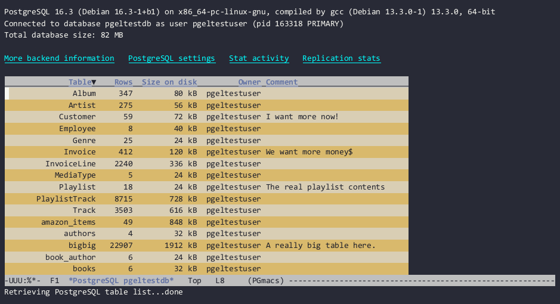

# Displaying a database table: the row-list buffer

A **row-list buffer** shows some metainformation on the table and its columns, then the row data in
tabular form, as illustrated below.

If the table contains a large number of rows, the contents will be **paginated**, with `Next` and
`Previous` buttons to move page by page. The number of rows in each page is determined by the
variable `pgmacs-row-limit`.

A column which is a part of a primary key will be displayed using the customizable
`pgmacs-column-primary-key` face, which defaults to a bold version of the `pgmacs-table-data` face.
A column which references a foreign key will be displayed using the `pgmacs-column-foreign-key`
face, which defaults to a blue color.

The following keys are bound when the point is located in the row-list table:

| Key         | Binding                                                                              |
|-------------|--------------------------------------------------------------------------------------|
| `v`         | Display the value at point in a dedicated buffer.                                    |
| `RET`       | Edit the value at point in the minibuffer, or jump to foreign table.                 |
| `w`         | Edit the value at point in a widget-based buffer.                                    |
| `!`         | Run a shell command on the value at point, replacing the output if prefix argument.  |
| `M-u`       | Upcase the content of the current cell and update PostgreSQL.                        |
| `M-l`       | Downcase the content of the current cell and update PostgreSQL.                      |
| `M-c`       | Capitalize the content of the current cell and update PostgreSQL.                    |
| `DEL`       | Delete the row at point.                                                             |
| `M-left`    | Move to the previous column.                                                         |
| `M-right`   | Move to the next column.                                                             |
| `o`         | Prompt for a table name and open a new buffer displaying that table's data.          |
| `+`         | Insert a new row into the current table, prompting for new values in the minibuffer. |
| `i`         | Insert a new row, prompting for new values in a dedicated buffer.                    |
| `k`         | Copy the current row.                                                                |
| `y`         | Paste (yank) the copied row.                                                         |
| `j`         | Copy the current row to the kill ring in JSON format.                                |
| `R`         | Rename the current column.                                                           |
| `<`         | Move point to the first row of data.                                                 |
| `>`         | Move point to the last row of data.                                                  |
| number      | Move point to the nth column (numbering is zero-based).                              |
| `e`         | Open a new buffer to display the result of an SQL query.                             |
| `E`         | Execute SQL from an Emacs buffer and display the output.                             |
| `r`         | Redraw the table (does not refetch data from PostgreSQL).                            |
| `n`         | Next page of output (if table contents are paginated).                               |
| `p`         | Previous page of output (if table contents are paginated).                           |
| `S`         | Sort the table by the current column.                                                |
| `{`         | Make the current column narrower.                                                    |
| `}`         | Make the current column wider.                                                       |
| `T`         | Jump to the main PGmacs table-list buffer.                                           |
| `q`         | Kill the current buffer.                                                             |

## Follow foreign key references

A column that references data in a foreign table (`FOREIGN KEY`) will be shown in blue. If you type
`RET` when point is located on a foreign key reference, PGmacs will jump to the referenced row and column in
the other table. A new row-list buffer is opened; type `q` to come back to the orginal row-list
buffer.

## Viewing output from an SQL query

You can also view (but obviously not edit!) the output from an SQL query you enter. Type `e` in a
PGmacs buffer, which will prompt you for an SQL query in the minibuffer, then display the output in
a dedicated temporary buffer. Type `q` to kill the temporary buffer.

Likewise, PGmacs can display the output from an SQL query in an Emacs buffer. Type `E` and it will
prompt you for the buffer name, then display the query output in a dedicated temporary buffer.

