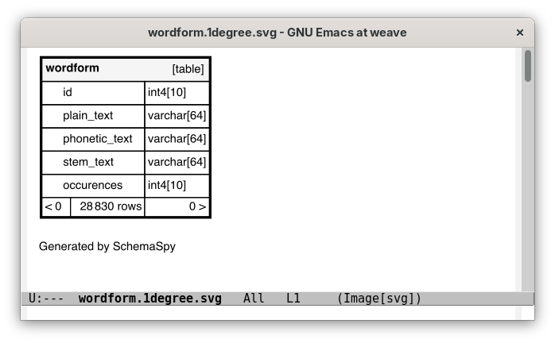

# Running SchemaSpy

In a row-list buffer, type `S` to run the [SchemaSpy application](https://schemaspy.org/) on the
current table and view the diagram of the table structure in a dedicated buffer. This functionality
only works in graphical mode (not in the terminal) and requires your Emacs to support SVG images.

See the customizable variable `pgmacs-schemaspy-cmdline` to adjust the commandline which runs
SchemaSpy to your local installation.

This functionality requires the following software to be installed:

  - SchemaSpy, installed to `~/lib/schemaspy.jar` with the default value of `pgmacs-schemaspy-cmdline`

  - Java (available as `java` here)

  - [GraphViz](https://graphviz.org/), installable on Debian using `sudo apt install graphviz` for example

  - JDBC support for PostgreSQL, here installed in `/usr/share/java/postgresql-jdbc4.jar`,
    installable on Debian for example using `sudo apt install libpostgresql-jdbc-java`

