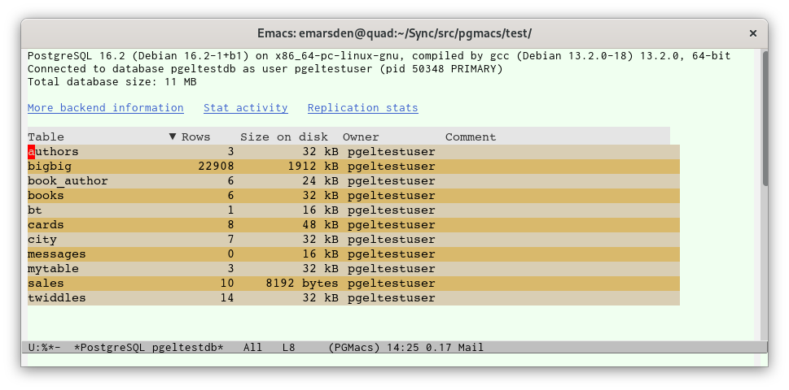
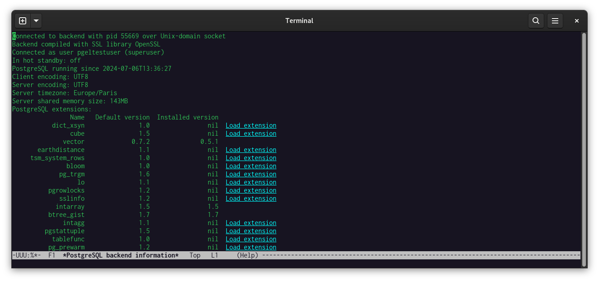

# The table list buffer

The table list buffer is the main PGmacs buffer. It shows some metainformation concerning the
PostgreSQL backend that you are connected to (version, database size on disk, etc.), followed by a
tabulated list of all the tables in the database (at least the tables which are visible to your
current PostgreSQL user).

The following keys are bound when the point is located in the table list buffer: 

| Key            | Binding                                                                              |
|----------------|--------------------------------------------------------------------------------------|
| <kbd>RET</kbd> | Open a new buffer to browse/edit the table at point.                                 |
| <kbd>Del</kbd> | Delete the table at point.                                                           |
| <kbd>r</kbd>   | Rename the table at point.                                                           |
| <kbd>o</kbd>   | Prompt for a table to browse/edit in a new buffer.                                   |
| <kbd>p</kbd>   | New buffer listing the functions and procedures in the current database.             |
| <kbd>e</kbd>   | Open a new buffer to display the output from an SQL query.                           |
| <kbd>E</kbd>   | Execute SQL from an Emacs buffer and display the output.                             |
| <kbd>S</kbd>   | [Run SchemaSpy](schemaspy.html) on the current database and display the SVG output.   |
| <kbd><</kbd>   | Move to the beginning of the table list.                                             |
| <kbd>></kbd>   | Move to the end of the table list.                                                   |
| <kbd>{</kbd>   | Make the current column narrower.                                                    |
| <kbd>}</kbd>   | Make the current column wider.                                                       |
| <kbd>g</kbd>   | Redraw the current buffer (refetches data from PostgreSQL).                          |
| <kbd>h</kbd>   | Display help for the table-list buffer.                                              |
| <kbd>q</kbd>   | Bury the current buffer.                                                             |

The `More backend information` button will open a buffer that displays further information
concerning the PostgreSQL backend that you are connected to, including the list of available
extensions.

